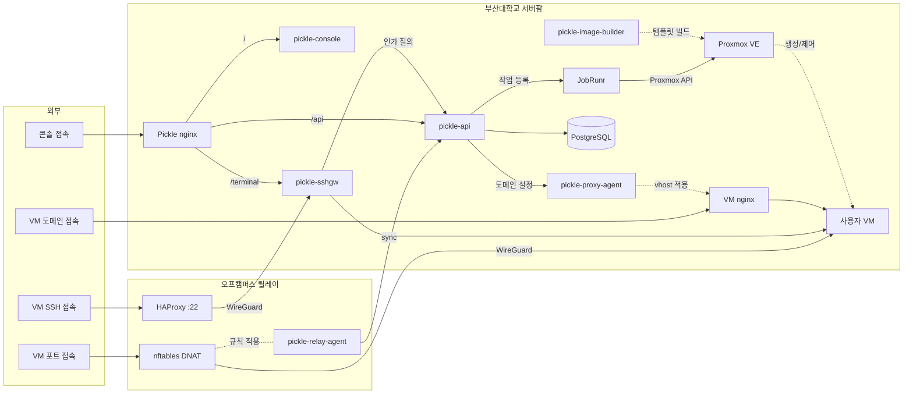

# PNUops

부산대학교 정보컴퓨터공학부 동아리입니다. 학내에서 실제로 운영되는 서비스를 직접
설계하고, 만들고, 배포하고, 운영합니다.

동아리 소개: https://pnuops.github.io/pnu-ops/

## 프로젝트

### 부산대학교 클라우드 플랫폼 (Pickle, 2026~)

  

부산대학교 구성원을 위한 셀프서비스 클라우드입니다. 웹 콘솔에서 VM을 신청하면 관리자
승인 후 Proxmox VE에 자동으로 프로비저닝되고, SSH 게이트웨이 접속과 웹 터미널,
도메인 기반 HTTPS 공개까지 제공합니다.

**접속: https://pickle.pusan.ac.kr**

<!-- arch:begin — 저장소 공통 블록입니다. 손으로 고치지 마세요. -->

| 저장소 | 역할 |
|---|---|
| [pickle-api](https://github.com/PNUops/pickle-api) | REST API와 프로비저닝 워커 (Spring Boot 4, Java 25, PostgreSQL 18, JobRunr) |
| [pickle-console](https://github.com/PNUops/pickle-console) | 사용자·관리자 웹 콘솔 (React 19, TypeScript) |
| [pickle-sshgw](https://github.com/PNUops/pickle-sshgw) | SSH 게이트웨이와 웹 터미널 브리지 (sshpiperd, Go) |
| [pickle-proxy-agent](https://github.com/PNUops/pickle-proxy-agent) | nginx 리버스 프록시 제어 에이전트 (Go) |
| [pickle-relay-agent](https://github.com/PNUops/pickle-relay-agent) | 오프캠퍼스 릴레이의 nftables DNAT 에이전트 (Go) |
| [pickle-image-builder](https://github.com/PNUops/pickle-image-builder) | 사용자 VM OS 이미지 빌드 레시피 (shell, virt-customize) |
| [pickle-infra](https://github.com/PNUops/pickle-infra) (비공개) | 인프라 프로비저닝 스크립트와 운영 런북 (shell) |
| [pickle-infra-example](https://github.com/PNUops/pickle-infra-example) | 프로비저닝·배포 스크립트와 런북 샘플 |
| [pickle-secrets](https://github.com/PNUops/pickle-secrets) (비공개) | 호스트 시크릿 볼트 (git-crypt) |
| [pickle-secrets-example](https://github.com/PNUops/pickle-secrets-example) | 볼트 레이아웃과 git-crypt 운용 절차 |
<!-- arch:end -->

### SW프로젝트관리시스템 (OPUS, 2025~)

  

부산대학교 내 SW프로젝트(캡스톤, 해커톤, 교과 등)의 성과를 등록하고 관리하고 공유하는
시스템입니다. 대회와 팀, 제출물을 운영 관점에서 다루며, 창의융합SW해커톤에서 시작해
여러 기여자가 함께 만들어 온 서비스입니다.

**접속: https://opus.pusan.ac.kr**

| 저장소 | 역할 |
|---|---|
| [opus-backend](https://github.com/PNUops/opus-backend) | 대회·팀·제출물 관리 API (Spring Boot 3.5, Java 17, MySQL 8, Redis) |
| [opus-frontend](https://github.com/PNUops/opus-frontend) | 프로젝트 전시와 심사 화면 (React 19, TypeScript, Vite, Tailwind) |
